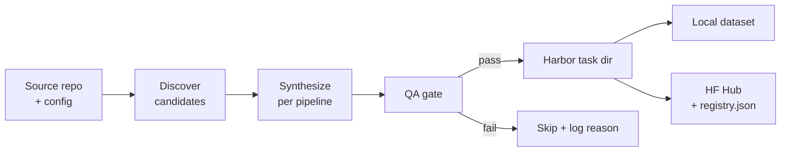

# Pipelines

A pipeline is a synthesis method that takes a repo and emits Harbor-shaped tasks. They share the same input shape (`GenerationInput`) and output shape (Harbor task dirs); they differ in **how** they manufacture verifiable tasks.

## Common shape

Every pipeline follows the same skeleton — only the box labelled "synthesize" varies.

## Status

| Pipeline | Status | Sandbox at gen | GPU helpful? | LLM at gen | Inspiration |
|---|---|:-:|:-:|:-:|---|
| [`pr_mining_lite`](./pr_mining_lite.md) | **implemented** | No | No | Optional | [SWE-RL](https://github.com/facebookresearch/swe-rl) |
| [`pr_mining`](./pr_mining.md) | planned | Harbor | If repo's tests need it (ML repos) | Optional | [SWE-bench](https://github.com/SWE-bench/SWE-bench) |
| [`commit_mining`](./commit_mining.md) | planned | Harbor | If repo's tests need it | Yes | [R2E-Gym SWE-GEN](https://github.com/R2E-Gym/R2E-Gym) |
| [`mutation`](./mutation.md) | planned | Harbor | Same as test suite | Yes | [SWE-smith](https://github.com/SWE-bench/SWE-smith) |
| [`oss_instruct`](./oss_instruct.md) | planned | Harbor | Sometimes | Yes | [Magicoder](https://github.com/ise-uiuc/magicoder) |
| [`equivalence_tests`](./equivalence_tests.md) | planned | Harbor | If function uses GPU | Yes | [R2E](https://github.com/r2e-project/r2e) |
| [`live_pr_mining`](./live_pr_mining.md) | planned | Harbor | Same as `pr_mining` | Optional | [SWE-bench-Live](https://github.com/microsoft/SWE-bench-Live) + [RepoLaunch](https://github.com/microsoft/RepoLaunch) |
| [`cve_mining`](./cve_mining.md) | planned | Harbor | Rarely | Yes | [PatchSeeker](https://github.com/hungkien05/PatchSeeker) / CVE-Bench |
| [`refactor_synthesis`](./refactor_synthesis.md) | planned | Harbor | Rarely | Yes | RefactoringMiner |

**Sandbox column legend**: "No" = pure text manipulation, no execution. "Harbor" = we delegate to Harbor's sandbox layer (Local Docker / Modal / Daytona / E2B / Runloop). We don't maintain a parallel abstraction.

The reference repos are cloned shallowly to `references/` (gitignored).

## Reward kinds emitted

| Pipeline | `diff_similarity` | `test_execution` |
|---|:-:|:-:|
| `pr_mining_lite` | ✅ | — |
| `pr_mining` | ✅ | ✅ |
| `commit_mining` | ✅ | ✅ |
| `mutation` | (oracle as diff) | ✅ |
| `oss_instruct` | optional | ✅ |
| `equivalence_tests` | — | ✅ |
| `live_pr_mining` | ✅ | ✅ |
| `cve_mining` | ✅ | ✅ |
| `refactor_synthesis` | — | ✅ |

`diff_similarity` works without a sandbox; `test_execution` requires one.

## Adding a new pipeline

1. Create `src/repo2rlenv/spec/options.py:<NameOptions>` (Pydantic, `extra="forbid"`)
2. Register it in `OPTIONS_REGISTRY`
3. Implement `src/repo2rlenv/pipelines/<name>.py:<Name>Pipeline` with a `run(out_dir) -> PipelineResult` method
4. Register in `src/repo2rlenv/pipelines/__init__.py:PIPELINES`
5. Add a doc here with: status, algorithm sketch, options table, `[metadata.repo2env.<name>]` schema, example invocation

Per-pipeline docs follow the same template — see [`pr_mining_lite.md`](./pr_mining_lite.md) for the canonical example.
