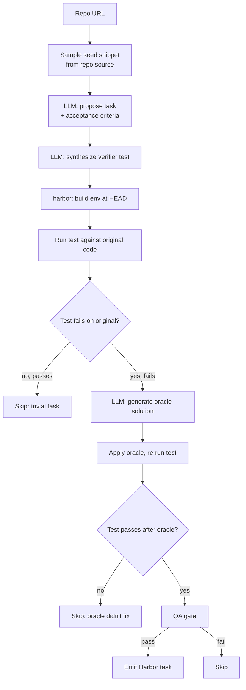

# `code_instruct`

Magicoder OSS-Instruct, but **grounded in a specific target repo**. The LLM proposes plausible coding tasks seeded by the repo's actual code, then we synthesize a verifier and validate by execution.

| | |
|---|---|
| Status | **planned** |
| Sandbox required at gen | Yes |
| LLM required at gen | Yes (issue + verifier + oracle synthesis) |
| Reward kinds emitted | `test_execution`, optionally `diff_similarity` |
| Inspiration | [Magicoder](https://github.com/ise-uiuc/magicoder) (ICML '24) |
| Reference clone | `references/magicoder/` |

## What's different vs vanilla OSS-Instruct

Magicoder samples random snippets from a global OSS corpus. Repo2RLEnv's variant samples seeds from **the target repo**, so the synthesized task is solvable in *that* repo's environment. This closes a real gap — nobody fuses LLM-issued instructions with executable repo state.

## Algorithm sketch



1. Clone repo
2. Sample seed snippets (file + line range) within size constraints
3. **LLM generates** a coding task + acceptance criteria, conditioned on snippet
4. **LLM generates** a verifier (test) that exercises the criteria
5. Build Docker env at HEAD
6. Run synthesized test against ORIGINAL code: must FAIL (else task is trivial)
7. Apply LLM-generated reference solution (oracle); re-run test: must PASS
8. Emit Harbor task
9. QA gate (4 layers, especially false-negative — the LLM-generated test must actually catch errors)

## Options (planned)

```python
class OSSInstructOptions(BaseModel):
    limit: int = 100
    seeds_per_task: int = 1
    seed_min_loc: int = 30
    seed_max_loc: int = 200
    issue_temperature: float = 0.7
    test_synthesis_temperature: float = 0.3   # lower for tests
    require_test_executes: bool = True
```

## Magicoder is paper-grade, not library-grade

OSS-Instruct is a **recipe** (prompt template + sampling strategy), not a reusable framework. The 75K dataset exists; the pipeline doesn't. We reimplement from scratch (~200 LOC) — we don't vendor.

## What we'd reuse from `references/magicoder/`

- Prompt templates from `data_synthesis/`
- Their snippet-sampling heuristics
- Decontamination filters
