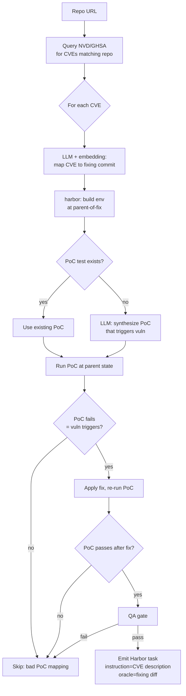

# `cve_mining`

Map CVEs to fixing commits, replay pre-fix state, capture security PoC as the verifier.

| | |
|---|---|
| Status | **planned (v1.0)** |
| Sandbox required at gen | Yes |
| LLM required at gen | Yes (NVD-to-commit mapping + PoC synthesis) |
| Reward kinds emitted | `test_execution`, `diff_similarity` |
| Inspiration | [PatchSeeker](https://github.com/hungkien05/PatchSeeker), CVE-Bench (NAACL '25), [PATCHEVAL](https://arxiv.org/pdf/2511.11019) |
| Reference clone | (to add — not yet cloned) |

## Why this pipeline matters

Lots of **datasets** of CVE-fix pairs exist (PatchSeeker: 5K CVEs across 2K repos; PATCHEVAL: 1K CVEs across 65 CWEs). What doesn't exist: a **reusable pipeline** that takes a repo + its CVE history and turns it into Repo2RLEnv tasks. Plenty of paper-only artifacts; no library.

This pipeline closes that gap.

## Algorithm sketch



1. Query NVD / GHSA for CVEs matching the target repo
2. Map each NVD record → fixing commit (PatchSeeker-style: LLM + embedding similarity)
3. Replay parent-of-fix state in a Docker env
4. Identify or **synthesize a PoC test** that triggers the vulnerability before the fix and passes after
5. Emit Harbor task: instruction = CVE description, oracle = fixing diff, verifier = the PoC
6. QA gate

## Options (planned)

```python
class CVEMiningOptions(BaseModel):
    limit: int = 100
    nvd_query: str | None = None             # CPE filter, e.g. "cpe:django:django"
    min_severity: Literal["low", "medium", "high", "critical"] = "medium"
    require_poc: bool = False
```

## `[metadata.repo2env.cve_mining]` schema (planned)

```toml
[metadata.repo2env.cve_mining]
cve_id = "CVE-2024-12345"
cwe = "CWE-79"
severity = "high"
nvd_url = "https://nvd.nist.gov/vuln/detail/CVE-2024-12345"
fixing_commit = "abc123..."
disclosed_at = "2024-08-01"
```

## Open questions

- How aggressively do we synthesize PoCs the dataset doesn't already ship? Synthesizing PoCs has security implications — should be opt-in and gated.
- How do we handle CVEs that have no public PoC and no fix-attached test? Skip them, or LLM-synth a regression test from the diff?
