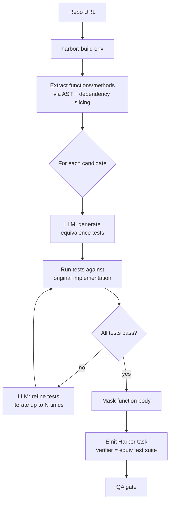

# `equivalence_tests`

R2E-style function-level synthesis. Extract a function, mask its body, ask the agent to re-implement it; verify via LLM-generated equivalence tests against the ground-truth implementation.

| | |
|---|---|
| Status | **planned** |
| Sandbox required at gen | Yes |
| LLM required at gen | Yes (test generation) |
| Reward kinds emitted | `test_execution` |
| Inspiration | [R2E](https://github.com/r2e-project/r2e) (ICML '24) |
| Reference clone | `references/r2e/` |

## What an "equivalence test" is

R2E's framing: a test that **uses the ground-truth implementation to check equivalence**, instead of predicting expected outputs. Crafted inputs are passed to both the masked-out function and the original; outputs must match. This avoids the LLM having to invent expected values.

## Algorithm sketch



1. Clone repo, build env
2. Extract candidate functions/methods (AST) within size constraints
3. **LLM generates equivalence-tests** that call the function with crafted inputs and assert behavior matches a reference
4. Run tests against original code: must PASS (validates test correctness)
5. Mask the function body — task = "implement the function so equivalence tests pass"
6. Emit Harbor task; verifier runs the equivalence test suite
7. QA gate (4 layers)

## Options (planned)

```python
class EquivalenceTestsOptions(BaseModel):
    limit: int = 100
    target_kind: Literal["function", "method"] = "function"
    min_loc: int = 5
    max_loc: int = 100
    tests_per_target: int = 3
    iterations: int = 3   # rounds of test generation w/ feedback
```

## What we'd reuse from `references/r2e/`

- AST-based function extraction with dependency slicing
- The equivalence-test prompt templates
- Their iterative test-generation-with-feedback loop
- The CLI experiment-id workflow pattern (`r2e setup -> extract -> generate`)
