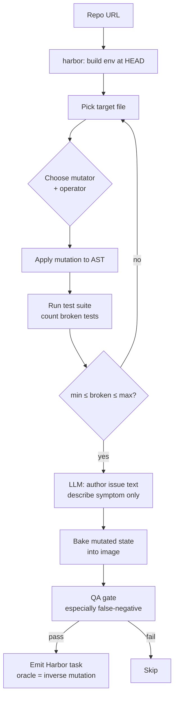

# `mutation`

SWE-smith-style: deliberately corrupt the code, keep mutations that break ≥1 test.

| | |
|---|---|
| Status | **planned** |
| Sandbox required at gen | Yes |
| LLM required at gen | Yes (authors the issue text) |
| Reward kinds emitted | `test_execution`, `diff_similarity` (oracle = inverse of mutation) |
| Inspiration | [SWE-smith](https://github.com/SWE-bench/SWE-smith) (NeurIPS '25 Spotlight) |
| Reference clone | `references/SWE-smith/` |

## Algorithm sketch



1. Clone repo + build env at HEAD
2. Apply a mutation operator (AST rewriter) to a target file
3. Run test suite in container, count breaks
4. If `min_tests_broken ≤ count ≤ max_tests_broken`: keep
5. **LLM authors issue text** describing the symptom (without revealing the mutation)
6. Emit Harbor task with the mutated state baked into the image
7. QA gate (4 layers; especially false-negative — does SOTA model fail this?)

The "fix" is the **inverse mutation** — recorded as the oracle.

## Why mutation

- High yield per repo (you can apply many mutations to the same file)
- Synthetic but verifiable via tests
- Addresses a gap: SWE-smith is 94% Python; nobody ships polyglot mutation synthesis as a reusable framework

## Options (planned)

```python
class MutationOptions(BaseModel):
    limit: int = 100
    mutators: list[str] = ["ast"]            # ast | ast-rewriter | ...
    operators: list[str] | None = None       # delete_statement | swap_operator | ...
    min_tests_broken: int = 1
    max_tests_broken: int | None = 5         # cap to avoid catastrophic mutations
    seed: int | None = None                  # determinism
```

## Polyglot strategy

- Python: AST rewrites (built-in)
- Java: [Pitest](https://pitest.org/)
- JS/TS: [Stryker](https://stryker-mutator.io/)
- C/C++: [Mull](https://github.com/mull-project/mull)
- Go: [go-mutesting](https://github.com/zimmski/go-mutesting)

Each language adapter applies a mutation and verifies via the language-native test runner. Output is unified Harbor format.

## What we'd reuse from `references/SWE-smith/`

- Mutation operator catalog
- The "filter to ≥1 broken test" gate (it's exactly what we need)
- Their issue-generation prompt templates
- **NOT**: their Ubuntu-only container assumptions (we wrap, not run directly on macOS)
