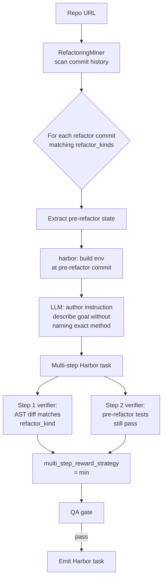

# `refactor_synthesis`

Detect historical refactor commits, synthesize "refactor X without breaking tests" tasks. Verifier is multi-criteria: (1) the refactor structurally happened, (2) existing tests still pass.

| | |
|---|---|
| Status | **planned (v1.0)** |
| Sandbox required at gen | Yes |
| LLM required at gen | Yes (instruction synthesis) |
| Reward kinds emitted | `test_execution` (multi-criteria via multi-step Harbor task) |
| Inspiration | [RefactoringMiner](https://github.com/tsantalis/RefactoringMiner), [refactoring-ai datasets](https://github.com/refactoring-ai) |
| Reference clone | (to add — not yet cloned) |

## Why this pipeline matters

Refactoring datasets exist; refactoring **synthesis pipelines for LLM training don't**. Refactoring is a natural fit for verifiable rewards: existing tests must still pass after the refactor (binary signal), AND the refactor must structurally have happened (AST diff signal). Repo2RLEnv could be the first to ship this as a reusable pipeline.

## Algorithm sketch



1. RefactoringMiner identifies historical refactor commits (extract-method, rename, etc.)
2. Pre-refactor state extracted as the task base commit
3. **Multi-step Harbor task**:
   - Step 1 verifier: structural diff matches the refactor kind (no LLM needed — it's an AST check)
   - Step 2 verifier: pre-refactor tests still pass after agent's change
4. LLM authors instruction describing the desired refactor (without naming the exact method)
5. Emit; QA gate

`multi_step_reward_strategy = "min"` → both steps must succeed for full reward.

## Options (planned)

```python
class RefactorSynthesisOptions(BaseModel):
    limit: int = 100
    refactor_kinds: list[str] = ["extract-method", "rename"]
    detector: Literal["RefactoringMiner"] = "RefactoringMiner"
    require_tests_unchanged: bool = True
```

## `[metadata.repo2env.refactor_synthesis]` schema (planned)

```toml
[metadata.repo2env.refactor_synthesis]
refactor_kind = "extract-method"
detector = "RefactoringMiner-3.0.6"
original_commit = "a1b2c3d"
refactored_commit = "d4e5f6g"
```

## Why it's deferred to v1.0

RefactoringMiner is JVM-based — adds a non-Python dep to the runtime. Worth doing once we have polyglot mutation in v0.x and are already shipping JVM containers for Java/Kotlin support.
